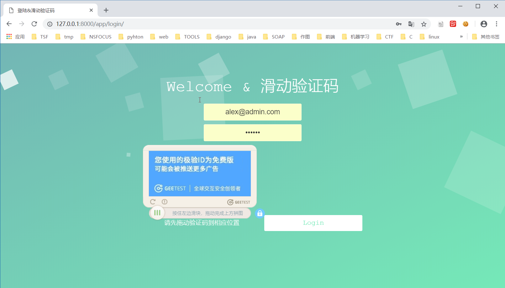
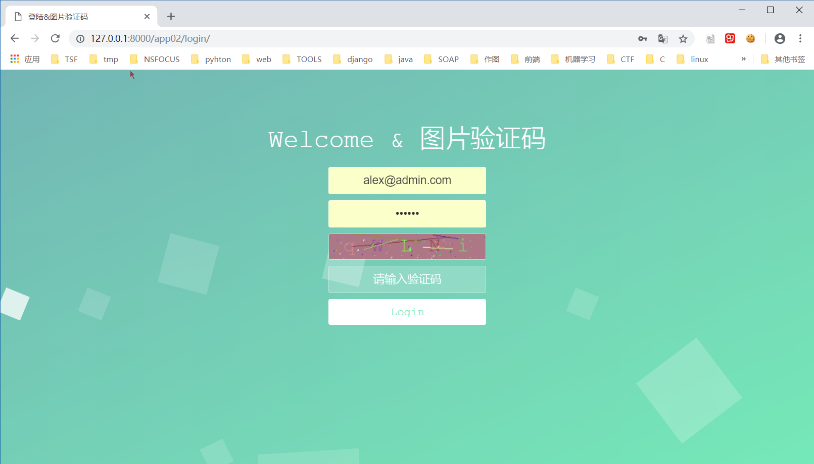

### DJANGO 下滑动验证码和图片验证码的


###  滑动验证码采用的是极验科技的验证码




### 图片验证码是自己写的代码生成的



```python
#获取验证码图片
def get_valid_img(request):
    from PIL import  Image,ImageDraw,ImageFont
    import random,string

    #获取随机颜色
    def get_random_color():
        return tuple(map( lambda x:random.randint(0,255),range(3)))

    print get_random_color()
    #生成图片对象

    img_obj = Image.new('RGB',(220,35),get_random_color())

    # 写入文字 画笔对象
    draw_obj = ImageDraw.Draw(img_obj)

    # 使用字体，获取一个字体对象
    font_obj= ImageFont.truetype("static/cour.ttf",28)

    #生成随机字符
    code_str=random.sample(string.letters,5)
    for i,ch in enumerate(code_str) :
        draw_obj.text((20+40*i,0),ch,fill=get_random_color(),font=font_obj)

    #验证码的值保存到session中

    request.session['valid_code'] ="".join(code_str)

    #加入干扰线
    width=220
    height=35
    for i in range(5):
        x1,x2=map(lambda x:random.randint(0,width),range(2))
        y1,y2=map(lambda x:random.randint(0,height),range(2))
        draw_obj.line((x1,y1,x2,y2),fill=get_random_color())

    #加入干扰点

    for i in range(40):
        x,y=random.randint(0,width),random.randint(0,height)
        draw_obj.point((x,y),fill=get_random_color())
        x, y = random.randint(0, width), random.randint(0, height)
        draw_obj.arc((x,y,x+4,y+4),0,90,fill=get_random_color())
    #生成的图片不需要保存到磁盘，保存到内存中即可

    from io import  BytesIO
    io_obj=BytesIO()
    img_obj.save(io_obj,'png')
    data=io_obj.getvalue()
    return  HttpResponse(data)


```